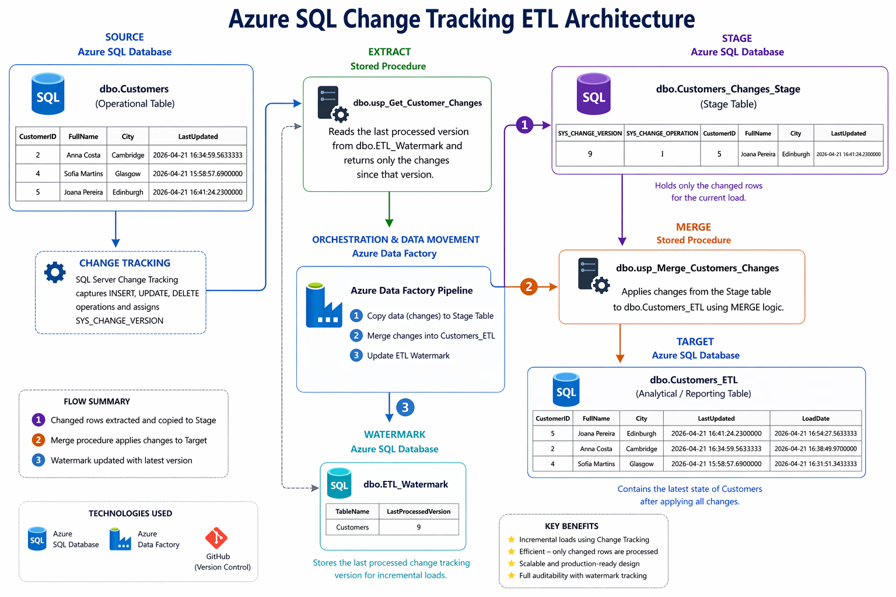

# Marcello Azure SQL Change Tracking ETL


## Overview

This project demonstrates a cloud-based incremental ETL solution built in Microsoft Azure using **Azure SQL Database**, **SQL Change Tracking**, and **Azure Data Factory (ADF)**.

The solution captures inserts, updates, and deletes from a source table and applies only new changes to a target table using a watermark-driven pipeline.

## Architecture

1. Source data stored in `dbo.Customers`
2. SQL Change Tracking records net row changes
3. Watermark table stores the last processed version
4. ADF extracts only new changes via stored procedure
5. Changes load into a staging table
6. MERGE procedure applies changes to target table `dbo.Customers_ETL`
7. Watermark updates after successful load



## Technologies Used

* Azure SQL Database
* Azure Data Factory (V2)
* T-SQL
* SQL Change Tracking
* Git / GitHub
* SSMS

## Database Objects

### Tables

* `dbo.Customers` - Source table
* `dbo.Customers_ETL` - Final target table
* `dbo.Customers_Changes_Stage` - Staging table for deltas
* `dbo.ETL_Watermark` - Stores last processed version

### Stored Procedures

* `dbo.usp_Get_Customer_Changes`
* `dbo.usp_Merge_Customers_Changes`
* `dbo.usp_Update_ETL_Watermark`
* `dbo.usp_Clear_Customers_Changes_Stage`

## Pipeline Flow

1. Read new changes since watermark
2. Truncate staging table
3. Copy changes into stage
4. Merge into target table
5. Update watermark

## Example Incremental Scenarios

* New customer inserted -> added to target
* Existing customer updated -> refreshed in target
* Customer deleted -> removed from target

## Key Skills Demonstrated

* Incremental ETL design
* Change data processing
* Azure Data Factory orchestration
* Stored procedure automation
* MERGE logic for upserts/deletes
* Cloud resource setup and management
* Version control with GitHub

## Repository Structure

```text
/sql   -> SQL scripts
/adf   -> ADF exports / pipeline JSON
/docs  -> Notes and architecture docs
README.md
```

## How to Run

1. Deploy Azure SQL resources
2. Execute SQL scripts in order
3. Publish ADF linked services, datasets, and pipelines
4. Make source data changes
5. Run pipeline `PL_Load_Customer_Changes`
6. Validate target tables and watermark

## Future Improvements

* CI/CD with GitHub Actions or Azure DevOps
* Parameterized multi-table framework
* Logging and audit tables
* Retry/error handling
* Environment separation (Dev/Test/Prod)
* Monitoring and alerts

## Author

Marcello Da Silva Lopes
